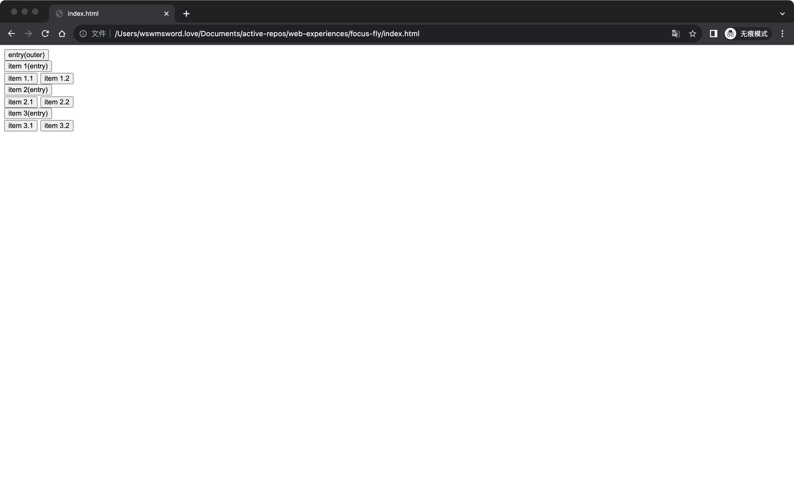

# 使用事件委托组织嵌套焦点关系

可以用一系列事件组织一组焦点关系，这组焦点关系描述“焦点从入口进入列表，在列表中移动，并且从出口退出至入口”。从描述可以看出来，这样不能支持嵌套的焦点关系，也即如果有嵌套，必须另外新建若干用于嵌套的一系列事件，嵌套关系的焦点有很多场景，比如连续弹窗、树形结构；第二个问题是性能问题，可能会由第一个嵌套问题引起，同时页面也可能会有大数量的需要组织焦点的地方，这都会创建许多事件，初始化许多事件会引起性能问题。

上面的两个问题可以通过事件委托解决。

`index.html` 中，简单模拟了使用事件委托，完成嵌套焦点关系的组织。下面是页面效果的截图：

打开 `index.html` 后会出现上面截图中的界面。进行交互，按下 <kbd>Tab</kbd>，焦点落在 `entry(outer)` 上，按下 <kbd>Enter</kbd>，焦点落在 `item 1(entry)`，按住 <kbd>Tab</kbd>，焦点将在 `item 1(entry)`、`item 2(entry)`、`item 3(entry)` 之间循环，在任意焦点上停止，例如在 `item 3(entry)` 上停下，按下 <kbd>Enter</kbd>，焦点将落在 `item 3.1` 上，这时按住 <kbd>Tab</kbd>，焦点又会在 `item 3.1` 和 `item 3.2` 之间循环，最后按下 <kbd>Escape</kbd>，焦点退回 `item 3(entry)` 上，再次按下 <kbd>Escape</kbd>，焦点退回最初的 `entry(outer)` 之上。

整个交互过程，包含了嵌套的入口、列表和出口，但是在实现上，只在根元素注册了单个 `keydown` 监听事件。

在 `index.html` 中的样品代码实现上，大致需要关注组织嵌套焦点关系的数据结构、监听函数中对于入口、列表和出口的区分、通过入口寻找列表的方法、通过出口回到入口的方法、以及列表内记住前一个焦点的方法。