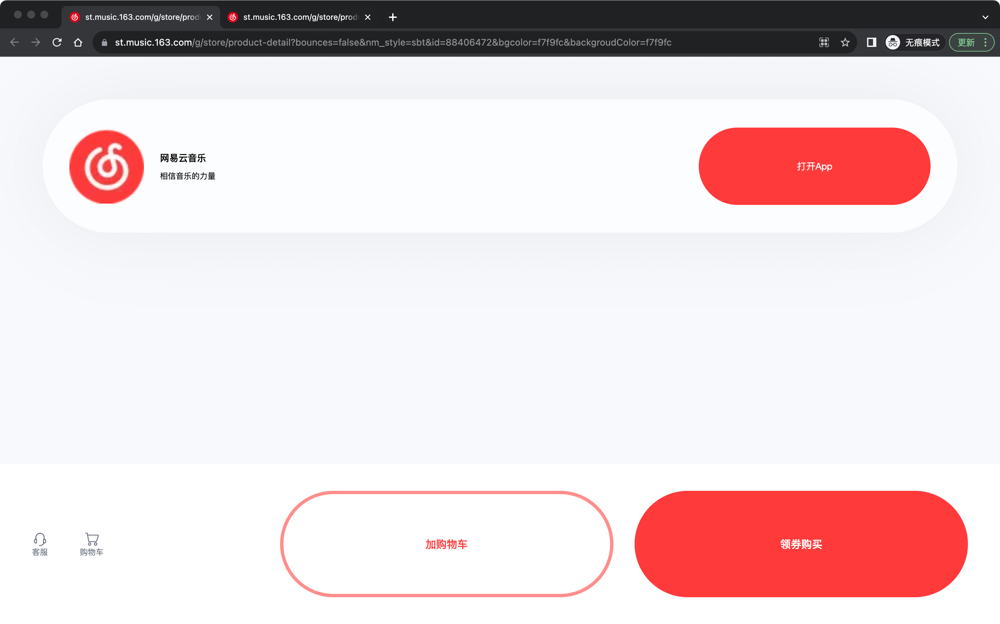
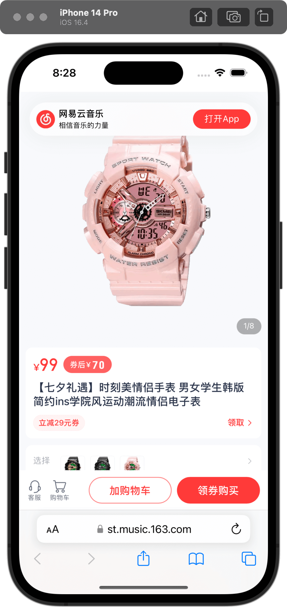
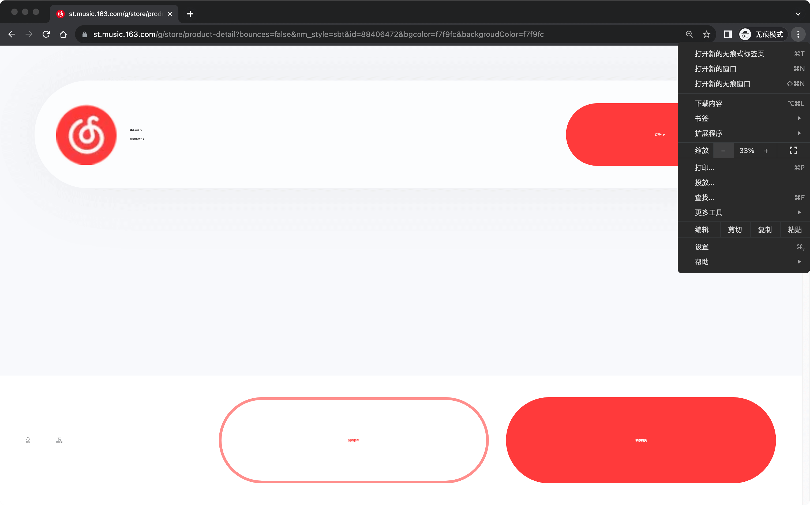
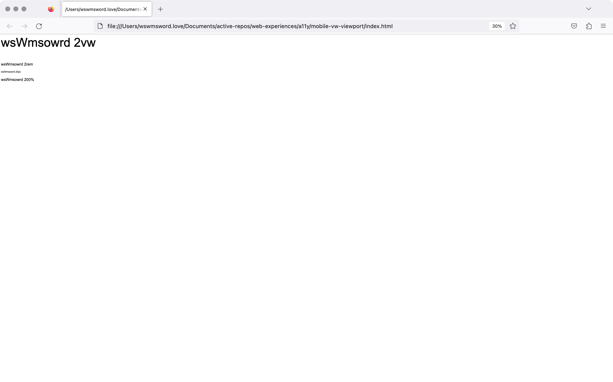
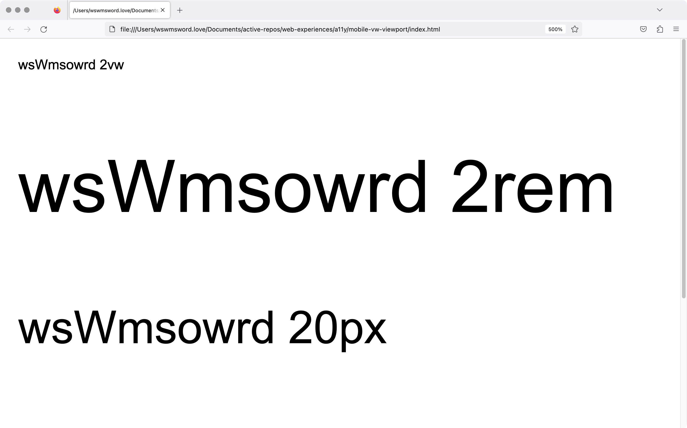

# 关于移动端应用 vw 伸缩视图的无障碍访问

在中国，有很多移动端应用使用 `vw` 做屏幕适配，如果所有的尺寸单位都基于 `vw`，那么这个应用就是根据屏幕宽度伸缩的。开发应用的单位通常把这种应用只投放在移动端，而期望不会出现在桌面端，因为伸缩视图在每种移动设备上展示的完全一致的效果，所以认为这是一种很好的适配方法。

这样适配最直接的问题就是不能在桌面端访问，如果通过桌面端访问，将看到巨大的字体和 UI。例如下面这个[界面](https://st.music.163.com/g/store/product-detail?bounces=false&nm_style=sbt&id=88406472&bgcolor=f7f9fc&backgroudColor=f7f9fc)，左边是桌面端的展示效果，右边是移动端的展示效果：

<table>
	<tr>
		<td></td>
		<td></td>
	</tr>
</table>

这是 `vw` 的第一个问题，正如上面第一张图展示的，UI 在宽屏幕上太大了。作为用户，现在我会同时按下 <kbd>Cmd</kbd> 和 <kbd>-</kbd>，或者在菜单里找到缩小按钮，来让 UI 变小。下面是这个 `vw` 伸缩页面缩放至 33% 的效果：

这是 `vw` 的第二个问题，手动通过浏览器缩小后，UI 仍然巨大无比。可以看到这个界面的字体已经缩小了，这是因为这个界面的字体进行了单独的适配，没有使用 `vw`，但通常，很多应用连字体也会使用 `vw`，这就会导致，即使已经缩小了屏幕，但界面几乎没有改变。

之所以会出现这个问题，是因为 `vw` 是基于屏幕宽度的单位。当用户进行缩小，浏览器（Chrome、Firefox、Edge）会模拟更大的屏幕，从而让原尺寸的元素在更大的屏幕上看起来更小。`vw` 不同，例如一个字体的 `font-size: 2vw`，屏幕宽度为 `1000px`，字体的 `2vw` 等于 `20px`，缩小 200% 后，屏幕宽度变为 `2000px`，字体的 `2vw` 等于 `40px`，字体大小看起来放大了两倍，但是由于屏幕在相同的宽度下模拟了原宽度的两倍，因此字体大小在观感上，实际上没有变化。

也就是说，`vw` 单位的字体，无论浏览器如何缩小放大，观感上都不会变化。有一些特殊情况，会导致满足这些情况后，`vw` 也会受缩放影响，这里暂时不考虑，例如 Chrome 浏览器字体最小 `12px` 的限制，Safari 浏览器不同于火狐、Chrome 的缩放机制。

这个文件夹内，打开 `index.html`，通过浏览器的缩放，可以看到文字“wsWmsowrd 2vw”在一定范围内，都不会发生观感上的变化。下面左边的图片展示了缩放 30% 的界面，右边展示了缩放 500% 的界面：

<table>
	<tr>
		<td></td>
		<td></td>
	</tr>
</table>

如果界面不能缩放，不能调整文本，那么这个网页应用是不能满足 WCAG 2.1 AA 级的，也就是说，所有的 `vw` 伸缩页面应用都不是 WCAG 2.1 AA 级的。

> 除了字幕和文本图像外，文本大小不需要辅助技术就可以放大至200%，且没有内容或功能损失。——WCAG 2.1，成功标准 1.4.4 调整文本（AA 级）