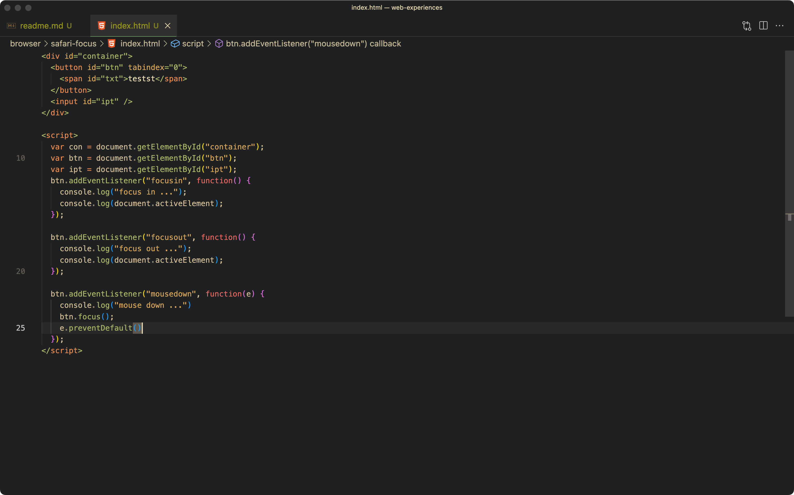
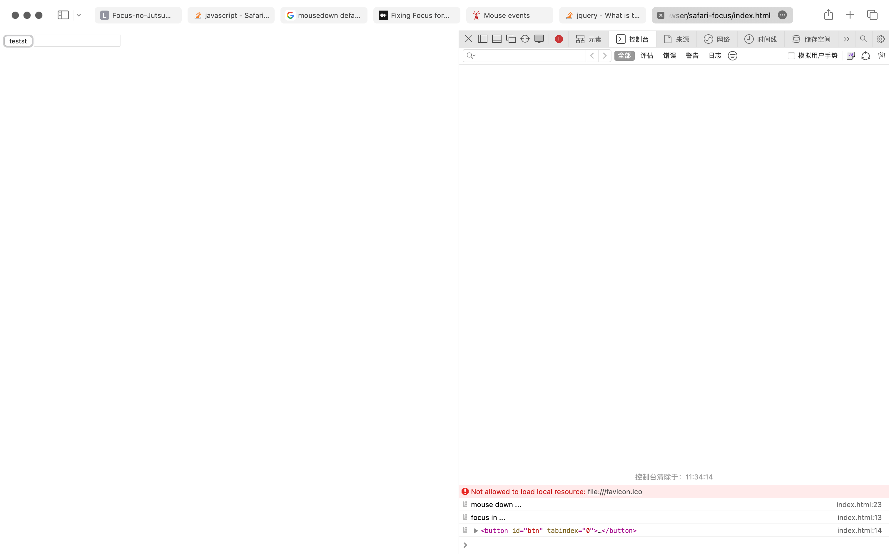
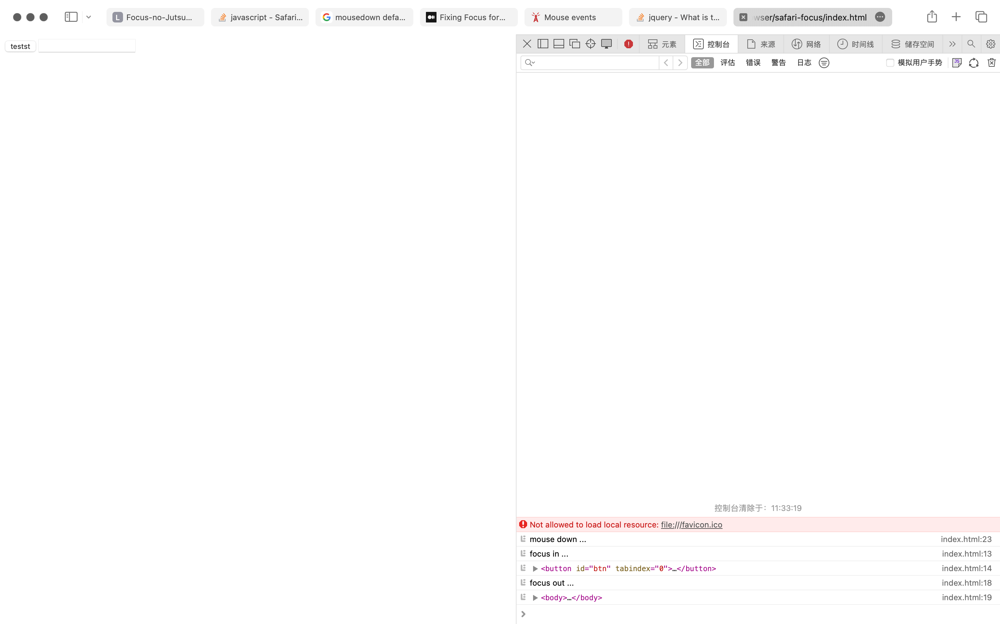

# Safari 按钮点击聚焦问题

默认情况，Safari 就有和其它浏览器不一样的行为，如 <kbd>Tab</kbd> 不到按钮、链接等，这个通过偏好设置可以改正。

Safari 还有点击按钮按钮不会被聚焦的问题。为了抹平 Safari 和其它浏览器的差异，可以像代码里这样：

```javascript
btn.focus();
e.preventDefault()
```

在 `mousedown` 事件添加类似这两行。首先用 api 强行聚焦，然后阻止 `mousedown` 的默认行为。

强行聚焦后会导致新的问题，就是至少在 `focusout` 阶段，会发生失焦，焦点将回到 body 元素上。失焦的问题至少发生在 button 元素上，对于一般的带 `tabindex` 的 div，不会有失焦的问题，不过这样的 div 也不需要上面用于抹平行为的代码，它们默认是能被点击聚焦的。

为了解决这个问题，就需要阻止 `mousedown` 的默认行为，目前不清楚阻止默认行为能避免失焦的原理。

| 阻止默认行为 | 允许默认行为 |
|:--|:--|
|  |  |
|  |  |