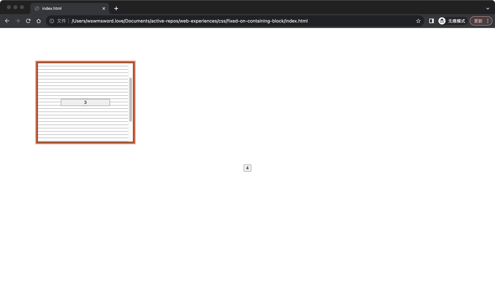

# 关于让元素可以基于指定的祖先元素定位

有一些特殊情况，需要指定某个祖先元素作为包含块，这样，一些 `fixed` 定位的元素，就可以基于指定的祖先元素定位。例如一个元素的样式如下：

```css
.e {
  position: fixed;
  width: 100%;
  right: 18px;
}
```

上面的样式，如果不指定某个祖先元素作为包含块，那么宽度 width 的值，就相当于 `100vw`，也就是屏幕的宽度。也许我们会希望这个 `100%` 是基于某个宽度为 `600px` 的祖先元素，也就是我们希望这个 `100%` 相当于 `600px`。

文件 `index.html` 演示了一个方法，来实现指定元素作为包含块。用浏览器打开文件后，会看到一个可滚动的正方形区域，其中包含了一个按钮，滚动正方形区域内部，可以看到，按钮始终居中于正方形区域。按钮是 `fixed` 定位的，按钮没有居中于屏幕，而是居中于正方形区域，这是因为正方形区域被指定为了包含块。



如何指定包含块？`index.html` 演示了一种方法，即对某个需要指定的元素添加 `transform: translateZ(0);`，MDN 还提供了[几个其它的方法](https://developer.mozilla.org/zh-CN/docs/Web/CSS/Containing_block#%E7%A1%AE%E5%AE%9A%E5%8C%85%E5%90%AB%E5%9D%97)：

- will-change 的值是 `transform` 或 `perspective`；
- filter 的值不是 `none` 或 will-change 的值是 `filter`（只在 Firefox 下生效）；
- contain 的值是 `paint`（例如：`contain: paint;`）；
- backdrop-filter 的值不是 `none`（例如：`backdrop-filter: blur(10px);`）。

`fixed` 定位的元素通常是需要基于一个滚动区域不变的，只是指定某个祖先元素作为包含块是不够的，还需要满足滚动区域的元素不是那个被设定为包含块的祖先元素，也就是说，`overflow: auto` 不能设定在包含块上，需要设定在包含块的子元素上。可以从 `index.html` 看到结果，文件中添加了一层选择器为 `.necessary_viewport` 的元素，这个元素具有具体的宽高，有 `overflow: auto`。相反，`failed-index.html` 将 `overflow: auto` 设定在了包含块上，滚动的时候，原本 `fixed` 定位的按钮也跟随滚动了，没有达到预期的滚动时固定按钮的效果。

属性 sticky 也可以实现上述的效果，具体查看 `sticky.html`，这也是更自然、原生的实现，但是基于某些特殊情况，上述通过指定包含块的实现方法也是需要的。