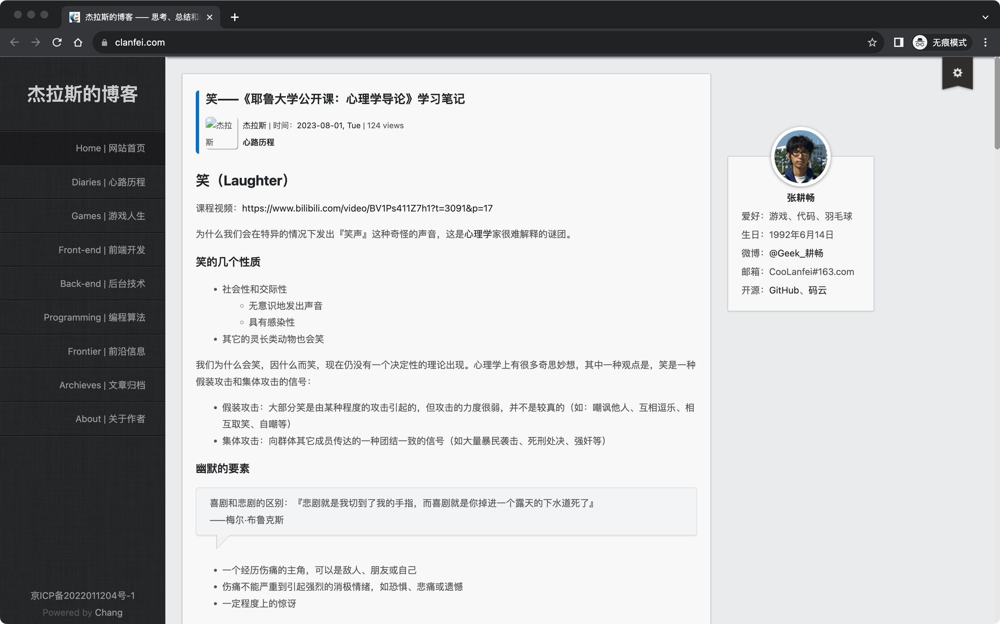

# 两栏布局

两栏式布局，通常左边是菜单，右边是内容，例如下面这张网页截图：

这个文件夹内的两个 HTML 文件展示了如何利用 `flex` 实现两栏布局（横向和纵向），并且布局可以从外部限制宽度，也即这样的布局可以是某个元素的子元素，另外，布局的内部元素也不会因为自身的宽度大于两栏布局，而撑开两栏布局。

- 各种布局的咕果教程：*https://web.dev/one-line-layouts/*
- 各种布局的阮一峰教程：*https://www.ruanyifeng.com/blog/2020/08/five-css-layouts-in-one-line.html*