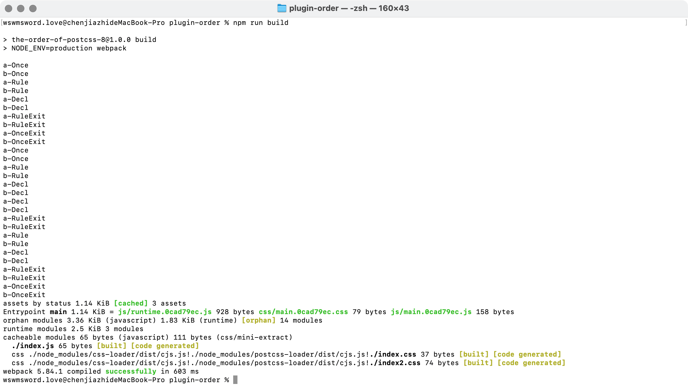

# PostCSS 插件的执行顺序

这个文件夹内创建了两个 PostCSS 插件，并且模拟一般的开发场景，在其中使用这两个插件。PostCSS 的插件开发，涉及到 PostCSS 提供的多个钩子，例如 `Rule` 会在扫描到选择器的时候调用，`Declaration` 会在扫描到属性的时候调用，这些钩子在多个插件之间，具体执行顺序是怎样的，这个文件夹用于验证这个问题。

下面是执行该文件夹后，控制台的结果：

从上面的截图可以看到，不同的多个插件，相同的钩子会一起执行。首先是钩子 `Once`，先执行插件 a 的 Once，再执行插件 b 的 Once，接着是钩子 `Rule`，先执行插件 a 的 Rule，再执行插件 b 的 Rule，以此类推。

直到一个文件的 CSS 全部扫描完，会扫描下一个文件，下一个文件又重新执行之前的步骤。假设上一个文件是 `index.css`，下一个文件是 `index2.css`，那么现在首先是钩子 `Once`，先执行插件 a 在 `index2.css` 的 Once，再执行插件 b 在 `index2.css` 的 Once，接着是钩子 `Rule`，以此类推。