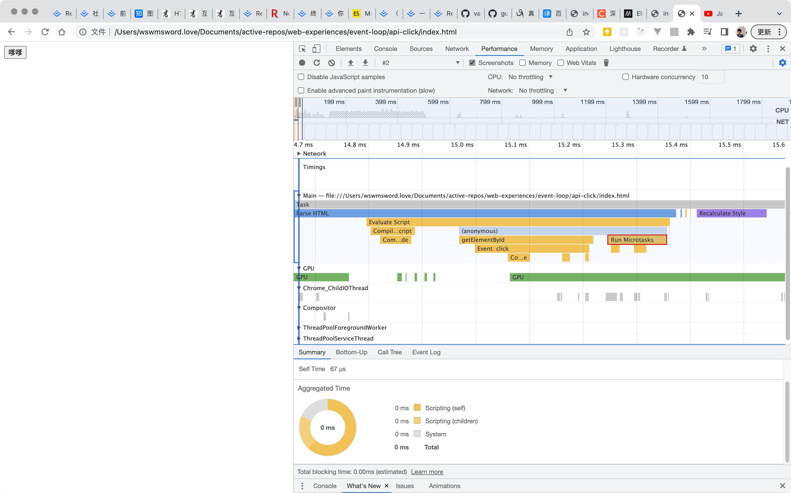

和[原生点击](../native-click/)做比较。

api 调用，`btn.click()`，
- `btn.click()` 进入 javascript 执行栈，
- 函数 a 入 javascript 执行栈，
- 直接调用函数 a，“Micro 1”加入微任务队列，打印“Listener 1”，
- 函数 a 出栈，函数 b 入栈，
- 直接调用函数 b，“Micro 2”加入微任务队列，打印“Listener 2”，
- 函数 b 出栈，
- `btn.click()`执行完毕，出栈，
- 打印“Ending”，
- 清空微任务队列，先打印“Micro 1”，再打印“Micro 2”。

这里能看到，通常说的事件是宏任务的说法，这里不适用，这里的函数 a 和函数 b 没有进入宏任务队列，而是直接在 javascript 执行栈按顺序执行，中途遇到的微任务添加到微任务队列。

这张图片展示了微任务在开发者工具的展现：
