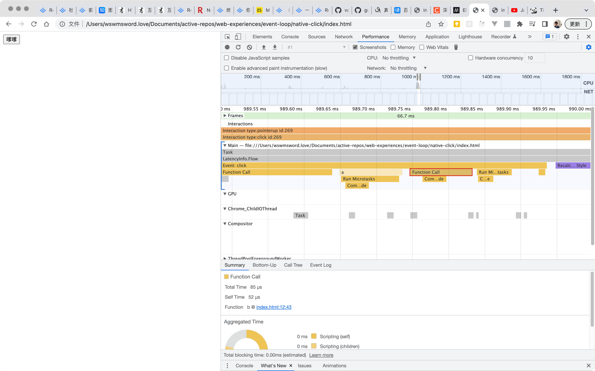

和[使用 api 点击](../api-click/)做对比。

点击之后，
- 函数 a 和函数 b 进入宏任务队列，
- 接着宏任务 a 进入 javascript 执行栈，执行函数 a，
- “Micro 1”进入微任务队列，打印“Listener 1”，
- 宏任务 a 出队，函数 a 出栈，现在清空微任务队列，打印“Micro 1”，
- 接着宏任务 b 进入 javascript 执行栈，执行函数 b，
- 重复函数 a 的过程……

这张图片展示了微任务在开发者工具的展现：
