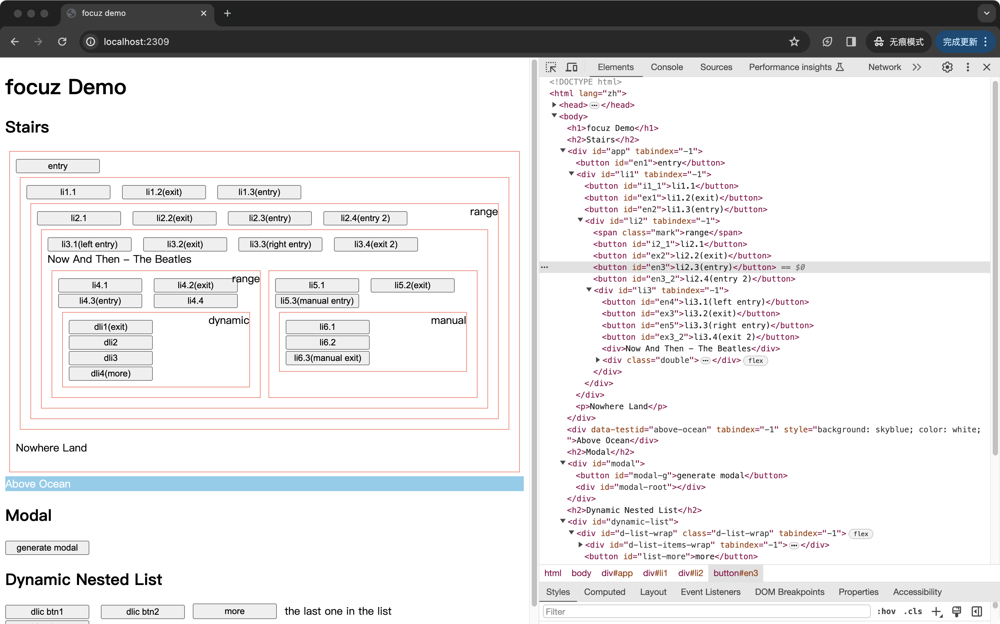

# 在一棵树上太空漫步

先序遍历一颗树，获得遍历的路径，这样的路径会应用在树形结构组件的访问，例如访问一个文件夹组件、嵌套分类组件，访问这些组件的时候，就像太空漫步，游走在每一个子项之间。

可以打开浏览器的开发者工具，查看一个太空漫步的示例，在开发者工具的 Elements 标签下，点击任意标签，然后在键盘上随意按下方向键，便能够访问这棵由 DOM 元素构成的树：



例如有这样一种结构，用来表示树形结构：

```javascript
const config = {
  entry: '0',
  list: ['a', 'b', 'c'],
  sub: [{
    entry: "c",
    list: ['g', 'h', 'i'],
    sub: {
      entry: "h",
      list: ['j', 'k'],
    }
  }, {
    entry: "a",
    list: ['d', 'e', 'f'],
  }]
};
```

这种树形结构，先序遍历后的路径则是：

```javascript
const expectedRoamList = ['0', 'a', 'd', 'e', 'f', 'b', 'c', 'g', 'h', 'j', 'k', 'i'];
```

下面是把上面的树形结构可视化的结果，从上至下阅读，可以得到先序遍历的路径：

```
.0
├── a
│   ├── d
│   ├── e
│   └── f
├── b
└── c
    ├── g
    ├── h
    │   ├── j
    │   └── k
    └── i
```

在这个文件夹内，`index.js` 文件内提供了针对上面的树形结构，获得先序遍历路径的方法，可以直接粘贴至浏览器的控制台运行。